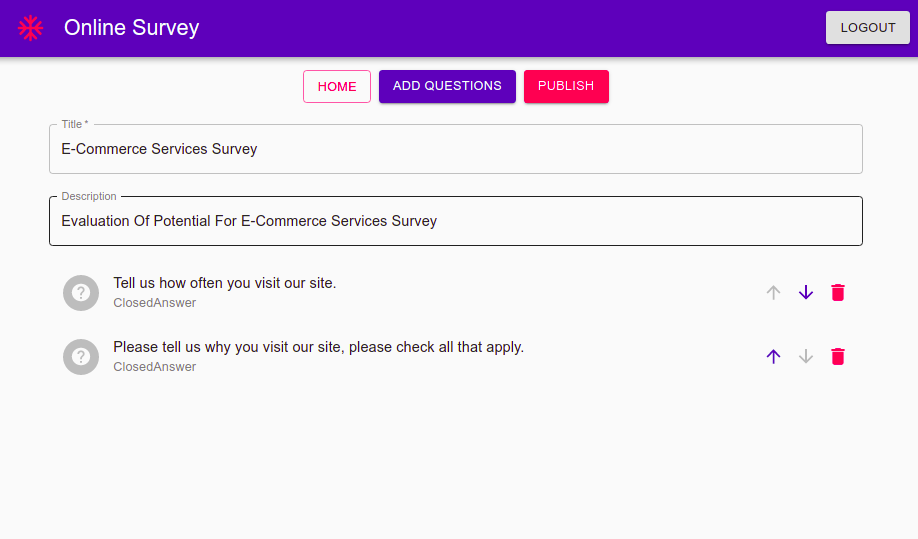
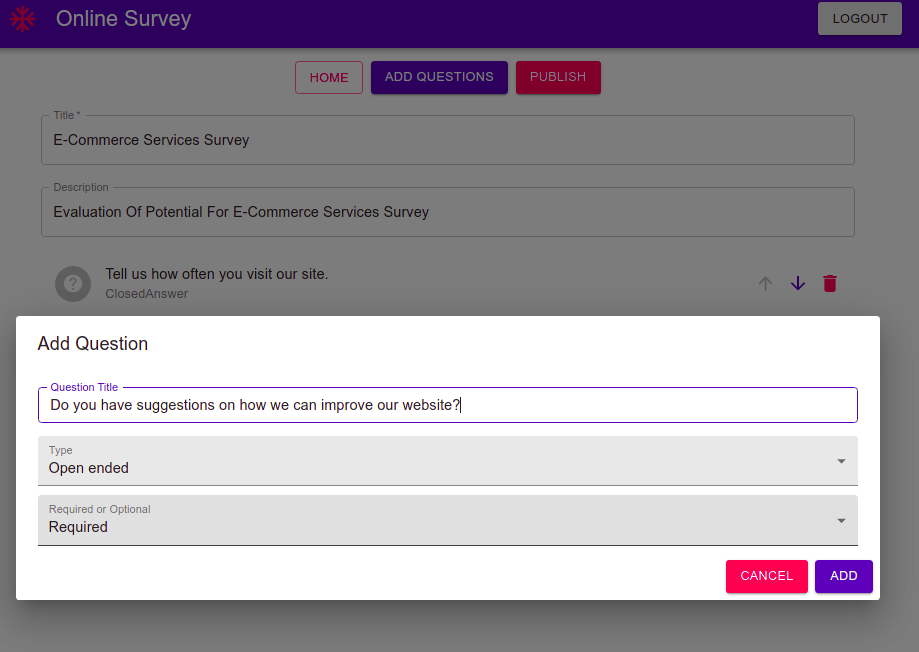
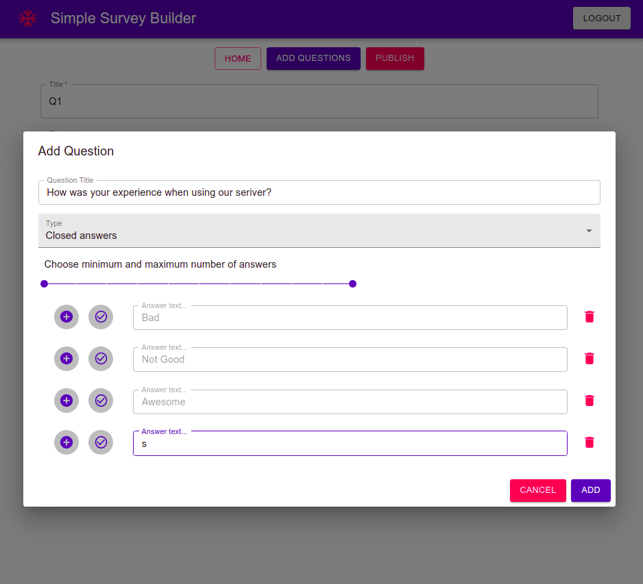

## Screenshots





## React Client Application Routes

- Route `/`: Homepage
- Route `/login`: Login page
- Route `/admin/home`: admin home page, see surveys and responses
- Route `/admin/create`: admin create page, for creating the surveys
- Route `/admin/results/:surveyID`: see the responses of a given survey by its ID

## API Server


- GET `/api/surveys`
  - response - Array of survey objects
```json
[
  {
  "title": "Customer Satisfaction Survey",
  "owner": "1",
  "description": "",
  "date": "2021-06-21",
    "questions": [
    {
      "type": "ClosedAnswer",
      "multipleChoice": [1, 1],
      "title": "How long have you been using the product?",
      "choices": [
        { "id": 0, "text": "less than 1 year", "selected": false },
        { "id": 1, "text": "1 or 2 years", "selected": false }
      ],
      "id": 0
    }
    ]
  }
]
```
- GET `/api/responses/:id`
  - `ID`
  - response - Array of survey response objects
```json
{
  "id": 41,
  "date": "2021-06-25",
  "title": "Customer Satisfaction Survey",
  "description": "",
  "respondee": "Marco",
  "questions": [
    {
      "id": 0,
      "type": "ClosedAnswer",
      "multipleChoice": [1, 1],
      "title": "How long have you been using the product?",
      "choices": [
        { "id": 0, "text": "less than 1 year", "selected": false },
        { "id": 1, "text": "1 or 2 years", "selected": true }
      ]
    }
  ]
}
```
- POST `/api/survey/add`
  - Request body content
```json
{
  "title": "Customer Satisfaction Survey",
  "owner": "1",
  "description": "",
  "date": "2021-06-21",
    "questions": [
    {
      "type": "ClosedAnswer",
      "multipleChoice": [1, 1],
      "title": "How long have you been using the product?",
      "choices": [
        { "id": 0, "text": "less than 1 year", "selected": false },
        { "id": 1, "text": "1 or 2 years", "selected": false }
      ],
      "id": 0
    }
    ]
}
```
- POST `/api/response/add`
  - Request body content
```json
{
  "id": 41,
  "date": "2021-06-25",
  "title": "Customer Satisfaction Survey",
  "description": "",
  "respondee": "Marco",
  "questions": [
    {
      "id": 0,
      "type": "ClosedAnswer",
      "multipleChoice": [1, 1],
      "title": "How long have you been using the product?",
      "choices": [
        { "id": 0, "text": "less than 1 year", "selected": false },
        { "id": 1, "text": "1 or 2 years", "selected": true }
      ]
    }
  ]
}
```
- ...

## Database Tables

- Table `users` - contains (id, email, password)
- Table `surveys` - contains (id, owner, survey)
- Table `responses` - contains (id, survey_id, response)
- ...

## Main React Components

- `SurveyModalCard` (`client/src/components/Shared/SurveyModalCard.js`): </br>
The modal (Dialog) used to show the survey to the user and also show the response to the admin. It also does the final validation for the user's response.
- `AddQuestionModal` (`client/src/components/Admin/AddQuestion/AddQuestionModal.js`): </br>
The modal used to add questions to the survey, containing other components that would identify the type of question and adding choices if the type of question is "ClosedAnswer".
- `ResponseResults` (`client/src/components/Admin/Responses/ResponseResults.js`): </br>
This modal is similar to `SurveyModalCard` but also has another component `Stepper` that handles the navigation through all responses.


## Users Credentials

### Admin 1
- username: `admin1@gmail.com`
- password: `surveybuilder`
  - Customer Satisfaction Survey

### Admin 2
- username: `admin2@gmail.com`
- password: `surveybuilder`
  - E-Commerce Services Survey
  - Demographic Survey
